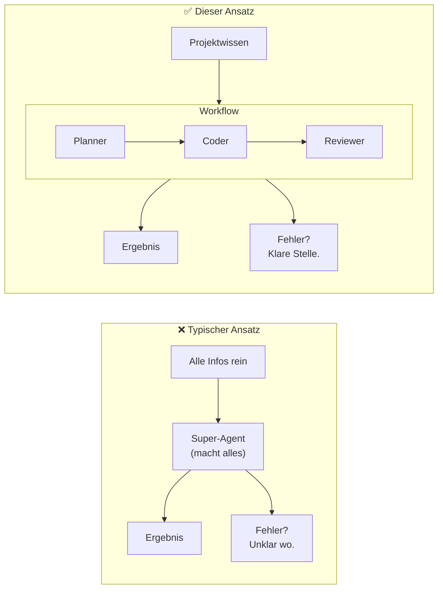
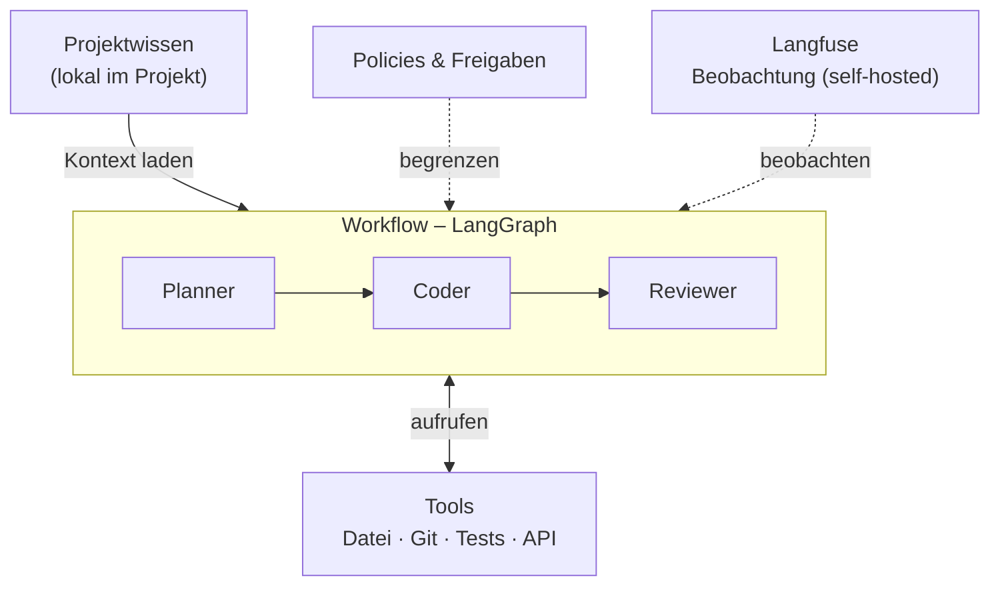
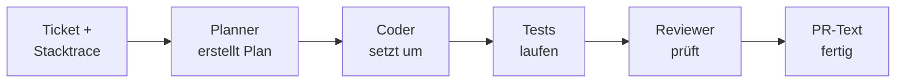
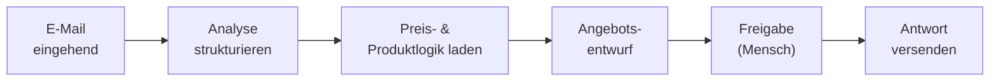

# KI-Agenten-Systeme – strukturiert, wiederverwendbar, kontrollierbar

Ein Konzept für den Aufbau von KI-gestützten Workflows, die in der Praxis funktionieren: nachvollziehbar, skalierbar und ohne Vendor-Lock-in.

---

## Das Problem

Die meisten KI-Agenten-Systeme scheitern nicht an der Technologie – sie scheitern am Aufbau.

Ein Agent, der alles kann, ist schwer zu verstehen, schwer zu testen und schwer zu verbessern. Wenn er falsch entscheidet, weiß niemand warum.

---

## Die Kernidee

**Erst der Ablauf, dann die Agenten.**

Ein Workflow beschreibt, was passiert – Schritt für Schritt. Agenten übernehmen klar abgegrenzte Rollen darin. Projektwissen wird gezielt geladen, nicht pauschal in jeden Agenten kopiert.

Das Ergebnis: ein System, das mit demselben Grundmodell einen Bugfix und einen Kundenprozess abbilden kann – ohne jedes Mal neu gebaut zu werden.

---

## Architektur

**Fünf Leitregeln:**
1. **Workflow first** – Ablauf vor Agenten
2. **Spezialisierte Agenten** – klein, klar, austauschbar
3. **Projektwissen im Workflow** – gezielt laden, nicht pauschal verteilen
4. **Lokal by default** – Wissen nah am Projekt
5. **Datenschutz als Architektur** – eingebaut, kein Nachgedanke

---

## Tech Stack – vollständig Open Source

| Komponente | Tool | Lizenz | Self-hosted |
|---|---|---|---|
| Modelle & Tools | LangChain | MIT | ✓ |
| Workflow-Engine | LangGraph | MIT | ✓ |
| Beobachtung & Evals | Langfuse | MIT | ✓ |
| Git & Repos | Gitea | MIT | ✓ |

Kein Vendor-Lock-in. Kein SaaS-Zwang. Alles läuft auf eigener Infrastruktur.

---

## Zwei Anwendungsfälle

### Coding: Bugfix-Workflow

Derselbe Workflow funktioniert für jedes Coding-Projekt – nur das Projektwissen (Architektur, Regeln, Pfade) wird ausgetauscht.

---

### Kundenprozess: Angebotsprozess

Projektwissen enthält: Preislogik, Produktkatalog, Angebotsvorlagen, Freigaberegeln. Der Kernworkflow bleibt identisch – Wissen und Integrationen werden ausgetauscht.

---

## Ausbaustufen

| | Minimal | Mittel | Komplex |
|---|---|---|---|
| **Agenten** | 3 (Planner, Coder, Reviewer) | 4–6 spezialisierte | Registry, versioniert |
| **Workflows** | 1 | 2–4 + Subgraphs | Bibliothek + Templates |
| **Projektwissen** | 1 Datei | Strukturiert, mehrere Dateien | Hybrid lokal/zentral |
| **Policies** | Manuell implizit | Schriftlich definiert | Technisch enforced |
| **Beobachtung** | Einfaches Log | Langfuse aktiv | Eval-Sets, Metriken |
| **Einstieg** | Sofort | Nach 1. funktionierendem Workflow | Wenn echter Skalierungsbedarf |

---

## Häufige Fragen

**Ist das nicht over-engineered für den Start?**
Nein. Stufe 1 besteht aus 3 Agenten, 1 Workflow und einer Projektwissen-Datei. Das ist weniger Aufwand als ein gut gepflegter langer Prompt – und deutlich wartbarer.

**Warum LangGraph und nicht CrewAI oder AutoGen?**
LangGraph bietet die präziseste Kontrolle über Workflow-State, Routing und Subgraphs. Es ist kein Opinionated-Framework, das Entscheidungen vorwegnimmt – es ist eine Workflow-Engine, die das eigene Modell umsetzt.

**Was kostet das im Betrieb?**
Der Stack selbst ist kostenlos. Kosten entstehen durch API-Aufrufe an Sprachmodelle (z.B. Anthropic, OpenAI) oder durch lokale Modelle (Ollama). Da Projektwissen gezielt injiziert wird, sind Token-Kosten niedriger als bei einem pauschalen Super-Agenten-Ansatz.

**Kann ich sofort damit anfangen?**
Ja. Ein minimales System (Planner → Coder → Reviewer, 1 Workflow) ist in einem Tag aufgebaut. Templates und Beispiele sind in diesem Repository enthalten.

**Ist das produktionsreif?**
Das Konzept ist produktionsreif. LangChain und LangGraph sind es ebenfalls. Die Reife des Systems hängt von der Implementierung ab – Policies, Eval-Sets und Tracing kommen mit den Ausbaustufen.

---

## Warum dieses Konzept

- **Nachvollziehbar**: Jeder Schritt ist klar, jeder Agent hat eine definierte Rolle – Fehler sind lokalisierbar
- **Wiederverwendbar**: Dieselben Workflows laufen für verschiedene Projekte, nur das Projektwissen wird ausgetauscht
- **Ressourceneffizient**: Kein pauschales Kontext-Dumping – gezieltes Laden spart Token-Kosten
- **Skalierbar**: Von 1 Workflow zu einer vollständigen Workflow-Bibliothek ohne Architekturbruch
- **Offen und kontrollierbar**: Vollständig Open Source, self-hosted, kein Vendor-Lock-in

---

*Vollständige Dokumentation: [`docs/`](docs/) · Beispiele: [`examples/`](examples/) · Einstieg: [`docs/00_vision_und_ziele.md`](docs/00_vision_und_ziele.md)*
