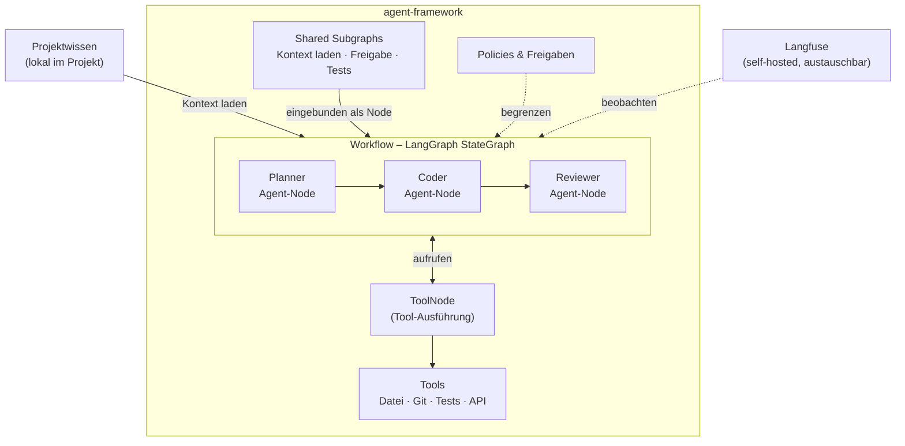

# Architekturüberblick

## Zielbild
Das Konzept trennt sauber zwischen Bauen, Orchestrieren und Beobachten.

## Technologische Leitplanke
Für dieses Repository ist die technologische Ausrichtung aktuell bewusst auf **LangChain** und **LangGraph** festgelegt.

Das Repository ist damit nicht als neutraler Marktvergleich gedacht, sondern als fokussierte Konzeptbasis für einen Stack, der als modern, anpassungsfähig und für agentische Workflows sehr geeignet betrachtet wird.

## Empfohlene Rollen der Bausteine

### LangChain
LangChain ist die Bibliothek für Modelle, Tools, einfache Agenten und allgemeine Anwendungsbausteine. Tools werden hier per `@tool`-Decorator oder `StructuredTool` definiert und per `llm.bind_tools()` an Agenten gebunden.

### LangGraph
LangGraph ist die Orchestrierungs- und Workflow-Ebene. Hier werden State (`TypedDict`), Nodes, Edges, Subgraphs, Interrupts und Routing modelliert. Der `ToolNode` aus `langgraph.prebuilt` übernimmt die automatische Ausführung von Tool-Calls.

### Beobachtungsschicht (austauschbar)
Die Beobachtungsschicht ist eine eigenständige, austauschbare Komponente – kein fester Teil des Kernstacks. Sie dient zur Nachvollziehbarkeit von Workflow-Runs, Debugging und Qualitätsmessung.

**Empfehlung: Langfuse**
Langfuse ist self-hostable, MIT-lizenziert und deckt Tracing, Evals und Prompt-Management ab. Die LangChain/LangGraph-Integration erfolgt über einen Callback.

Weitere Open-Source-Optionen:
- **Phoenix (Arize)** – starkes Tracing, LangChain-Integration
- **OpenLLMetry** – OpenTelemetry-basiert, vendor-neutral

Das Konzept setzt bewusst auf eine self-hostbare Lösung, um keine Abhängigkeit von kommerziellen Beobachtungsplattformen einzugehen.

### Eigene Management-Schicht
Nicht alles kommt fertig aus dem Ökosystem. Projekte, Agentenregister, Policies, Projektprofile und Kundenregeln sollten bewusst als eigene Fachschicht modelliert werden.

## Architekturdiagramm

## Kernmodell

- `agents/` enthält Rollen und ihre Tools
- `workflows/` enthält die Abläufe
- `tools/` enthält geteilte Tools
- `framework/shared_subgraphs/` enthält wiederverwendbare Teilworkflows
- projektspezifisches Wissen liegt vorzugsweise direkt im Projekt oder Kundenrepo
- zentrale Repositories enthalten Standards, Templates und Referenzwissen
- Repositories und externe Systeme bleiben eigenständige Ressourcen
- Policies und Monitoring spannen sich über alle Ebenen

## Aktueller Fokus des Repositories
Der Fokus liegt aktuell auf:
- Konzeptdokumentation
- Strukturverständnis
- Rollen- und Workflow-Modellen
- strategischer und fachlicher Klarheit

Nicht im Fokus liegt aktuell:
- Beispielcode
- Referenzimplementierung
- detaillierte produktionsnahe Datenschutzarchitektur

## Grundregel
Agenten liefern Fähigkeiten. Workflows steuern den Ablauf. Projektwissen wird im Workflow geladen und in den State geschrieben. Die Beobachtungsschicht ist austauschbar und unabhängig vom Kernstack.
