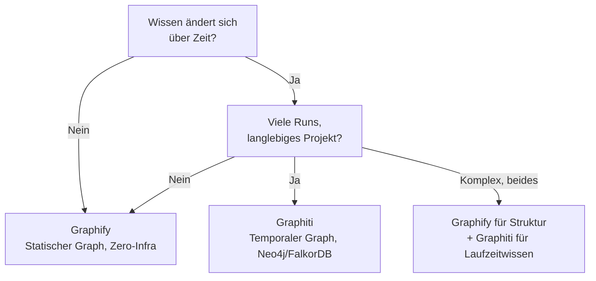
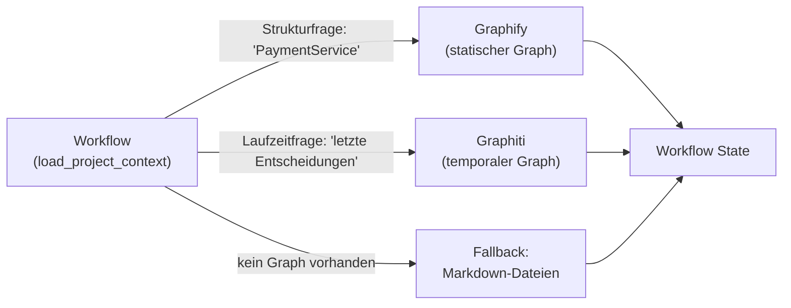

# Projektwissen und Kontext

## Grundregel
Projektspezifisches Wissen gehört primär in den Workflow und möglichst nah an das jeweilige Projekt. Es gehört nicht fest in die Agenten.

## Warum?
Wenn Projektwissen in Agenten verdrahtet wird, verlieren Agenten ihre Wiederverwendbarkeit. Wenn es im Workflow geladen wird, bleibt der Agent allgemein und der Ablauf wird projektspezifisch.

## Bevorzugte Wissensform: Knowledge Graph

Für projektspezifisches Wissen wird bevorzugt ein **Knowledge Graph** eingesetzt statt flacher Markdown-Dateien.

**Warum ein Graph besser ist als Flat Files:**
- Entitäten und ihre Beziehungen sind explizit modelliert – kein implizites Wissen in Fließtext
- Der Workflow fragt nur den relevanten Subgraph ab – keine ganzen Dateien in den Prompt laden
- Beziehungen zwischen Modulen, Bugs, Regeln und Personen sind direkt traversierbar (Multi-Hop)
- Wissen kann zur Laufzeit dynamisch ergänzt werden, ohne Dateien manuell zu editieren
- Token-Kosten sinken: statt 2000 Token für ein ganzes Dokument nur ~150 Token für den relevanten Subgraph

## Welches Graph-Tool – Graphify oder Graphiti?

Beide Tools sind MIT-lizenziert, self-hosted und unterstützen lokale Modelle. Sie lösen jedoch **unterschiedliche Probleme** und werden nach Ausbaustufe eingesetzt.

### Graphify – Stufe 1 (Minimal, sofort)

Graphify analysiert einen Projektordner (Code, Docs, Bilder, Audio) und baut daraus einen **statischen Knowledge Graph**. Kein Server, keine Datenbank – ein Ordner reicht.

- Ideal für: Architektur, Abhängigkeiten, Coding-Regeln, Dateistruktur
- Statt eine ganze Codebase in den Prompt zu laden: Agent fragt gezielt nach `PaymentService`
- Token-Reduktion: bis zu 71,5x gegenüber vollem Kontext-Dumping
- Zero-Infra: kein Neo4j, kein Vektorspeicher

### Graphiti – Stufe 2+ (Dynamisch, temporal)

Graphiti speichert Fakten mit **Zeitstempel** (`valid_from` / `valid_to`). Wenn Agenten über mehrere Runs hinweg lernen sollen – welche Entscheidungen getroffen wurden, welche Bugs gefixt sind, welche Anforderungen sich geändert haben – ist Graphiti die richtige Wahl.

- Ideal für: wachsendes Laufzeitwissen, Kundenprozesse, langlebige Projekte
- LangChain/LangGraph-Integration nativ via Callback
- Braucht eine Graphdatenbank (Neo4j, FalkorDB oder Kuzu)

### Entscheidungshilfe



| Ausbaustufe | Tool | Begründung |
|---|---|---|
| Stufe 1 – Minimal | Graphify | Zero-Infra, sofort einsetzbar |
| Stufe 2 – Mittel | Graphiti | Temporale Fakten, dynamisches Wissen |
| Stufe 3 – Komplex | Graphify + Graphiti | Struktur + Laufzeitwissen kombiniert |
| Fallback immer | Markdown-Dateien | Für einfache, stabile Projekte |

## Ladeablauf im Workflow



**Beispiel einer Subgraph-Abfrage (Graphify):**
```
Query: Subgraph um 'PaymentService'
Ergebnis:
  PaymentService → hängt_ab_von → StripeClient
  PaymentService → hat_bekannten_bug → NullPointer #42
  PaymentService → wird_genutzt_von → CheckoutFlow
  PaymentService → hat_regel → "nur in payment_service/ ändern"
```
Nur dieser kompakte Subgraph landet im Agenten-Prompt.

## Wann Flat Files als Fallback sinnvoll sind

Für einfache, stabile Projekte mit wenigen Entitäten reichen Markdown-Dateien vollständig aus. Der Graph lohnt sich ab:
- vielen verknüpften Komponenten (Microservices, Abhängigkeiten)
- dynamisch wachsendem Wissen (bekannte Bugs, Entscheidungen, Kunden)
- Projekten, bei denen der Kontext über mehrere Workflow-Runs hinweg wächst

## Arten von Wissen

### Stabiles Projektwissen
- Architektur und Modulbeziehungen
- Coding-Regeln
- relevante Verzeichnisse
- Test- und Build-Kommandos
- Sicherheits- und Compliance-Regeln

### Extrahiertes Repo-Wissen
- Dateibaum
- Modulstruktur und Abhängigkeiten
- relevante Dateien
- Testlandschaft
- wichtige Entry Points

### Laufzeitwissen
- Ticket
- Stacktrace
- Logs
- betroffene Dateien
- aktueller Diff

## Wo dieses Wissen liegen sollte

### Bevorzugt projektlokal
Direkt im Projekt oder Kundenrepo, als lokaler Knowledge Graph (Graphify/Graphiti) oder unter `project-knowledge/`.

### Zentral nur ergänzend
Für gemeinsame Sichtweisen, Templates oder Referenzstrukturen kann eine zentrale Ablage zusätzlich sinnvoll sein.

## Repo-Einbindung
Das eigentliche Git-Repository bleibt die operative Quelle. Das Projektwissen liegt entweder im Projekt selbst (als Graph oder Markdown) oder in einer begleitenden projektnahen Struktur.

## Typischer Ablauf
1. Workflow erhält `project_id` oder `repo_path`
2. Workflow prüft: Knowledge Graph vorhanden?
   - Ja (Graphify) → Subgraph-Query für Struktur und Abhängigkeiten
   - Ja (Graphiti) → Subgraph-Query für aktuelle Fakten und Entscheidungen
   - Nein → Markdown-Fallback aus `project-knowledge/`
3. Workflow ermittelt relevante Dateien und Regeln
4. State wird mit Projektkontext gefüllt
5. Agenten erhalten nur den nötigen Ausschnitt

## Merksatz
Projektwissen wird im Workflow injiziert. Graphify liefert die Struktur, Graphiti liefert das Laufzeitgedächtnis, Markdown ist der Fallback.
