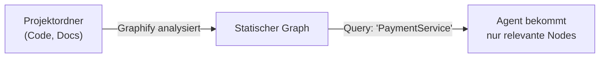
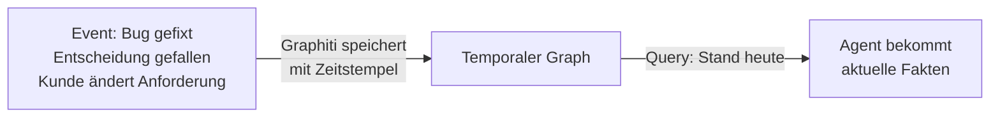

# Wissensablage: lokal vs. zentral

## Kurzfassung
Projektwissen sollte standardmäßig möglichst nah am Projekt liegen – bevorzugt als Knowledge Graph. Zentrale Ablagen sind sinnvoll für gemeinsame Standards, Policies und wiederverwendbare Bausteine.

## Empfohlenes Modell
Das Repository sollte mit einem hybriden Ansatz arbeiten:

- **projektlokal** für projektspezifisches Wissen – bevorzugt als Knowledge Graph
- **zentral** für übergreifende Standards und Framework-Bausteine

## Local by default, central by exception
Diese Regel ist für das Konzept besonders passend.

### Projektlokal
Projektspezifisches Wissen gehört idealerweise in oder nahe an das jeweilige Projekt oder Repository.

**Bevorzugte Form: Knowledge Graph**
Ein lokaler Knowledge Graph ist der empfohlene Weg für projektspezifisches Wissen, sobald das Projekt mehr als eine Handvoll Entitäten hat. Der Graph liegt direkt beim Projekt, wird mit ihm versioniert oder als lokale Datenbank betrieben und vom `load_project_context`-Schritt im Workflow abgefragt.

Vorteile gegenüber Flat Files:
- Beziehungen zwischen Modulen, Regeln, Bugs und Personen sind explizit und traversierbar
- Gezielte Subgraph-Abfrage statt ganzer Dokumente – spart Token
- Wissen kann zur Laufzeit dynamisch ergänzt werden
- Multi-Hop-Abfragen möglich: `ServiceA → nutzt → LibB → hat_bug → #123`

**Fallback: Markdown-Dateien**
Für einfache oder sehr stabile Projekte reichen Markdown-Dateien unter `project-knowledge/`. Der Workflow behandelt beide Quellen gleich – er fragt zuerst nach einem Graph, fällt auf Markdown zurück wenn keiner vorhanden ist.

Beispiele für projektlokales Wissen:
- Architekturhinweise und Modulabhängigkeiten
- Coding-Regeln
- Repo-Metadaten
- bekannte Probleme und Bugs
- Kundenbesonderheiten
- Build- und Test-Kommandos

Typische Struktur im Projekt-Repo:
```text
project-knowledge/
  graph/                   <- Knowledge Graph (bevorzugt)
  architecture.md          <- Fallback Flat File
  coding_rules.md          <- Fallback Flat File
  repo_config.yaml
  known_issues.md
```

### Zentral
Zentral gehören vor allem Inhalte hinein, die projektübergreifend gelten oder von vielen Projekten gemeinsam genutzt werden.

Beispiele:
- Agentenstandards
- Workflow-Templates
- globale Policies
- Datenschutz- und PII-Regeln
- Tool-Policies
- Best Practices
- Evaluations-Standards

---

## Knowledge Graph Tools: Graphify vs. Graphiti

Beide Tools bauen Knowledge Graphs für KI-Agenten – aber sie lösen **unterschiedliche Probleme** und ergänzen sich.

### Grundunterschiede

| | **Graphify** | **Graphiti** (getzep) |
|---|---|---|
| **Kernzweck** | Codebase & Docs → queryable Graph | Agenten-Gedächtnis über Zeit |
| **Eingabe** | Ordner: Code, Docs, Bilder, Videos | Conversations, Events, Structured Data |
| **Zeitlichkeit** | Nein – statischer Snapshot | Ja – jede Kante hat `valid_from`/`valid_to` |
| **Infrastruktur** | Kein Server, kein Vektorspeicher nötig | Braucht Neo4j, FalkorDB oder Kuzu |
| **Token-Reduktion** | bis zu 71,5x weniger Token | Subgraph-Queries (~150 Token) |
| **Sprachen/Formate** | 22 Programmiersprachen, PDF, Bilder, Audio | Beliebige Episoden (Text, JSON) |
| **LangGraph-Integration** | Indirekt (als Tool/Skill einbindbar) | Nativ via LangChain Callback |
| **Lokale Modelle** | ✓ | ✓ (Ollama) |
| **Lizenz** | MIT | MIT |
| **Einstiegsaufwand** | Sehr gering – ein Ordner reicht | Mittel – Graphdatenbank nötig |

### Graphify – wann verwenden

Graphify analysiert einen Projektordner und baut daraus einen statischen Knowledge Graph: Klassen, Funktionen, Module, Abhängigkeiten, Docs. Der Agent fragt dann gezielt „Welche Klassen nutzen PaymentService?“ statt eine ganze Codebase in den Prompt zu laden.

**Passend für:**
- Schnellen Einstieg ohne Infrastruktur
- Statisches Projektwissen (Architektur, Abhängigkeiten, Regeln)
- Stufe 1 (Minimal) – sofort einsetzbar, Zero-Infra
- Projekte, bei denen die Struktur sich selten ändert



### Graphiti – wann verwenden

Graphiti speichert Fakten mit Zeitstempel. Wenn ein Agent über mehrere Runs hinweg lernen soll – „Bug #42 wurde am Dienstag gefixt“, “Anforderung X wurde zurückgezogen“ – ist Graphiti die richtige Wahl. Wissen ändert sich im Graph, ohne dass alte Fakten gelöscht werden.

**Passend für:**
- Dynamisch wachsendes Wissen (Bugs, Entscheidungen, Kundeninfos)
- Langlebige Projekte, bei denen Kontext über viele Runs angesammelt wird
- Stufe 2–3 (Mittel/Komplex) – wenn Agenten “erinnern“ sollen
- Kundenprozesse mit sich ändernden Fakten (Preise, Status, Freigaben)



### Empfohlene Kombination nach Ausbaustufe

| Ausbaustufe | Wissensform | Empfehlung |
|---|---|---|
| **Stufe 1 – Minimal** | Statisch, überschaubar | Graphify – Zero-Infra, sofort einsetzbar |
| **Stufe 2 – Mittel** | Dynamisch, wächst mit dem Projekt | Graphiti – temporale Fakten, Neo4j/FalkorDB |
| **Stufe 3 – Komplex** | Beides | Graphify für Struktur + Graphiti für Laufzeitwissen |
| **Fallback immer** | Einfach, stabil | Markdown-Dateien in `project-knowledge/` |

---

## Warum der hybride Ansatz sinnvoll ist

### Vorteile der lokalen Ablage (Graph)
- näher am echten Projekt
- leichter aktuell zu halten
- zusammen mit dem Projekt versioniert
- Relationen zwischen Entitäten explizit modelliert
- gezieltere Kontext-Injektion, niedrigere Token-Kosten

### Vorteile der zentralen Ablage
- konsistente Standards
- bessere Wiederverwendung
- gemeinsame Governance
- weniger Streuung allgemeiner Regeln

## Konsequenz für dieses Konzept
Zentrale Profilstrukturen sollten nicht als einziger Ort für sämtliches Projektwissen verstanden werden. Das eigentliche Detailwissen liegt projektlokal – bevorzugt als Knowledge Graph.

## Praktisches Zielbild

### Projekt oder Kundenrepo
- `project-knowledge/graph/` ← Knowledge Graph (Graphify oder Graphiti je nach Stufe)
- `project-knowledge/*.md` ← Fallback Flat Files
- `repo_config.yaml`
- projektspezifische Regeln
- domänenspezifische Dokumentation

### Zentrales Konzept-Repo
- Templates
- FAQ
- Best Practices
- übergreifende Policies
- Referenz-Workflows

## Empfehlung
Für neue Implementierungen: projektbezogenes Wissen bevorzugt als lokalen Knowledge Graph anlegen. Stufe 1 startet mit Graphify (Zero-Infra), Stufe 2+ ergänzt Graphiti für temporales Laufzeitwissen. Das zentrale Repository bleibt der Ort für das gemeinsame Rahmenwerk.
