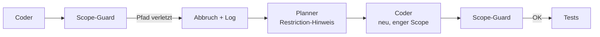
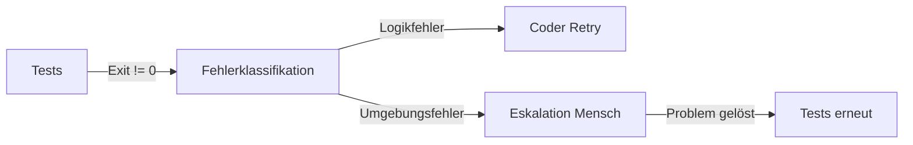

# Failure-Cases und Recovery-Flows

Diese Datei dokumentiert bekannte Fehlerfälle im Bugfix-Workflow und die empfohlene Reaktion des Systems. Jeder Fall beschreibt: was schiefgeht, warum, und wie der Workflow damit umgeht.

---

## Fall 1: Planner identifiziert falsche Datei

**Situation**
Der Planner erhält einen Stacktrace, der auf eine Hilfsfunktion zeigt – nicht auf die eigentliche Fehlerquelle. Er benennt die falsche Datei als Fixziel.

**Erkennungspunkt**
Reviewer oder Testlauf schlägt fehl: Änderungen in falscher Datei, Tests laufen grün, aber Originalfehler bleibt reproduzierbar.

**Recovery-Flow**

**Maßnahme**
- Feedback-Node injiziert: Ursprünglicher Stacktrace + Testergebnis + Hinweis „Fix hat Fehler nicht behoben“
- Planner erhält beim zweiten Durchlauf erweiterten Dateikontext (eine Ebene höher im Call-Stack)
- Maximale Retries: 2 – danach Eskalation an Mensch

---

## Fall 2: Coder greift außerhalb des erlaubten Scopes

**Situation**
Der Coder ändert Dateien außerhalb des festgelegten Projektpfads (z. B. gemeinsam genutzte Bibliothek statt isolierter Service).

**Erkennungspunkt**
Scope-Guard im Workflow prüft geänderte Dateipfade gegen erlaubte Verzeichnisse aus dem Projektwissen.

**Recovery-Flow**

**Maßnahme**
- Workflow bricht sofort ab, Änderungen werden **nicht** committet
- Planner wird mit explizitem Restriction-Hinweis neu aufgerufen: „Nur Änderungen in `payment_service/` erlaubt“
- Vorfall wird ins Trace-Log geschrieben (Langfuse oder äquivalent)

---

## Fall 3: Tests laufen nicht durch – Umgebungsfehler

**Situation**
Die Testausführung schlägt mit einem Infrastrukturfehler fehl (fehlende Abhängigkeit, falscher Branch, Datenbankverbindung nicht verfügbar) – kein Logikfehler im erzeugten Code.

**Erkennungspunkt**
Test-Exit-Code ist nicht 0, aber Fehlermeldung enthält keinen Hinweis auf den geänderten Code.

**Recovery-Flow**

**Maßnahme**
- Ein Klassifikations-Node unterscheidet: Logikfehler vs. Umgebungsfehler anhand Fehlermuster
- Bei Umgebungsfehler: sofortige Eskalation, kein sinnloser Coder-Retry
- Zustand des Workflows wird gespeichert – nach menschlichem Eingriff kann ab Teststufe fortgesetzt werden

---

## Fall 4: Reviewer lehnt ab – unklare Begründung

**Situation**
Der Reviewer markiert den Fix als unzureichend, liefert aber eine zu vage Begründung („Code könnte besser sein“), mit der der Coder nichts anfangen kann.

**Erkennungspunkt**
Reviewer-Output enthält kein konkretes Problem, keine Datei, keine Zeile.

**Recovery-Flow**

**Maßnahme**
- Qualitätscheck prüft Reviewer-Output auf Mindeststruktur: Datei + Problem + Vorschlag
- Falls nicht erfüllt: Reviewer wird erneut aufgerufen mit strukturiertem Output-Schema (z. B. JSON-Format)
- Maximale Reviewer-Retries: 1 – danach manuelle Review

---

## Allgemeine Recovery-Prinzipien

| Prinzip | Bedeutung |
|---|---|
| **Retry mit mehr Kontext** | Nicht blind wiederholen – immer zusätzliche Information mitgeben |
| **Scope vor Commit prüfen** | Änderungen erst validieren, nie blind committen |
| **Fehlerklasse bestimmen** | Logik- vs. Umgebungsfehler haben unterschiedliche Recovery-Pfade |
| **Maximale Retries begrenzen** | Endlosschleifen verhindern; nach N Versuchen Eskalation an Mensch |
| **Zustand persistieren** | Workflow-State speichern, damit Mensch nahtlos übernehmen kann |
